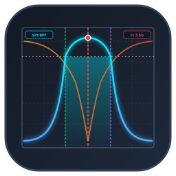

# Rohde & Schwarz VNA Filter Analyzer

A standalone, professional desktop application for analyzing and comparing Vector Network Analyzer (VNA) microwave filter measurements across Ubuntu Linux, Windows, and macOS. Designed specifically for microstrip and microwave filter characterization (including 5th-order hairpin filters with and without Defected Ground Structures — DGS).



---

## Key Capabilities

1. **Multi-Measurement Handling (1 to 4 Files Simultaneously)**:
   - Load up to 4 CSV or Touchstone (`.s2p`, `.s1p`) measurement files concurrently.
   - Compare multiple filter designs (e.g. *DGS* vs. *Without DGS* or progressive tuning sweeps) on a unified frequency grid.

2. **Smart VNA Import & Dialect Autodetection**:
   - **RVITM Laboratory Data**: Directly imports laboratory measurement folders containing extensionless files (`S11_with_DGS`, `S21_with_DGS`, etc.) and automatically scales frequencies from GHz to Hz. Dedicated **"📁 Import RVITM Folder"** button.
   - **Dassault CST Studio Suite Exports**: Natively parses 1D ASCII plot exports (`S2,1 / dB`, `S1,1 / dB`, `Frequency / GHz`).
   - **Rohde & Schwarz VNA CSVs**: Automatically detects CSV delimiters (comma, semicolon, tab, whitespace) and extracts instrument metadata from headers (R&S ZNB, ZVA, ZVL, sweep points, IFBW, test power).
   - **Touchstone Support**: Direct import of `.s2p` and `.s1p` files.
   - **Interactive Column Mapping**: 15-row preview dialog with manual column override support.

3. **High-Precision Filter Characterization**:
   - **Center Frequency ($F_c$)**: Parabolic vertex interpolation at transmission peak.
   - **Cutoff Frequencies ($f_L, f_H$)**: Sub-sample linear interpolation at -3 dB (or -1, -6, -10 dB) threshold crossings.
   - **Bandwidth ($BW$) & Fractional Bandwidth ($FBW, FBW\%$)**: $(f_H - f_L)$ and $[(f_H - f_L) / F_c] \times 100\%$.
   - **Insertion Loss ($IL$)**: Magnitude of peak attenuation ($-\text{Peak } S_{21}$) in positive dB convention, alongside measured peak $S_{21}$.
   - **Return Loss ($RL$) & VSWR**: Minimum in-band $S_{11}$, positive return loss convention, VSWR at $F_c$, and minimum VSWR.
   - **Loaded Q Factor**: $F_c / BW_{-3\text{dB}}$ with standard engineering disclaimer.
   - **Passband Ripple**: Peak-to-peak variation $\max(S_{21}) - \min(S_{21})$ across the passband.
   - **Stopband Rejection & Roll-Off Selectivity**: Lower and upper stopband attenuation floors, rejection at user-specified frequencies (e.g. 2.0, 2.5, 4.5, 5.0 GHz), and transition skirt slopes in dB/GHz.

4. **Interactive Visualization**:
   - Interactive Plotly graphics embedded in Qt (zoom, pan, hover coordinates, trace toggle, autoscale).
   - Interactive markers: vertical dashed lines for $F_c$, $f_L$, $f_H$, horizontal -3 dB reference line, peak marker, and semi-transparent shaded bandwidth region.
   - Dual-engine safety: Matplotlib canvas fallback for zero-crash display compatibility.
   - Display normalization toggle (aligns peaks to 0 dB for direct shape comparison without altering raw data).
   - Display smoothing options (Savitzky-Golay, Moving Average) with Raw / Smoothed / Both views.

5. **DGS vs. Non-DGS Comparative Workflow**:
   - Side-by-side comparison table of all 15+ parameters.
   - Differential analysis: $\Delta F_c$, $\Delta BW$, $\Delta \text{IL}$, $\Delta \text{RL}$, $\Delta FBW\%$, $\Delta Q$.
   - Automated engineering narrative summary.

6. **Comprehensive Export & Project Persistence**:
   - **Graph Export**: 300 DPI PNG, SVG, and vector PDF.
   - **Data Export**: CSV, formatted multi-sheet Excel (`.xlsx`), and JSON.
   - **Engineering PDF Report**: Professional multi-page report via ReportLab with embedded high-res plots, parameter cards, comparison table, and notes.
   - **Project Save/Load**: Save entire analysis sessions to `.vna` archives.

7. **Cross-Platform & Desktop Integration**:
   - Native Ubuntu `.desktop` launcher installed to `~/.local/share/applications/` (accessible from Ubuntu Application Drawer).
   - Windows one-click launcher (`run.bat`).
   - Linux/macOS launcher (`run.sh`).
   - Pip-installable Universal Wheel (`.whl`).

---

## How to Run on Any Computer with Python

### Option 1: Universal Wheel (`.whl`) — Any OS (Windows / macOS / Linux)
On any computer with Python 3.10+ installed:
```bash
# 1. Install the package:
pip install dist/vna_filter_analyzer-1.0.0-py3-none-any.whl

# 2. Launch the application:
vna-filter-analyzer
```

### Option 2: Windows Users
Double-click `run.bat` in the root folder.
- Automatically checks for Python.
- Sets up `.venv` on first run and installs required libraries.
- Launches the graphical application.

### Option 3: Linux / Ubuntu Users
- **Desktop Launcher**: Run `./install.sh` once. Afterwards, launch **"VNA Filter Analyzer"** directly from the Ubuntu Application Drawer or `Super` key.
- **Terminal**: Run `./run.sh`.

---

## Directory Layout

```
.
├── dist/                               # Pre-built distributable package
│   └── vna_filter_analyzer-1.0.0-py3-none-any.whl
├── vna_filter_analyzer/                # ALL application Python source files
│   ├── __init__.py                     # Package exports
│   ├── main.py                         # Entry point & CLI argument parser
│   ├── main_window.py                  # Central application window
│   ├── plot_widget.py                  # Interactive Plotly widget with fallback
│   ├── filter_list_widget.py           # 1-4 filter management sidebar
│   ├── analysis_panel.py               # Individual filter analysis panel & KPI cards
│   ├── comparison_panel.py             # Comparison table & DGS improvement analysis
│   ├── raw_data_panel.py               # Raw tabular data viewer with search & copy
│   ├── import_dialog.py                # 15-row preview and column mapping dialog
│   ├── settings_dialog.py              # App preferences & stopband test frequencies
│   ├── styles.py                       # Dark and light modern themes
│   ├── csv_parser.py                   # CSV, RVITM, Dassault CST, & Touchstone parser
│   ├── data_model.py                   # S-parameter data classes and metrics models
│   ├── data_quality.py                 # Quality checks (NaNs, duplicates, monotonicity)
│   ├── smoothing.py                    # Savitzky-Golay & Moving Average filters
│   ├── peak_detection.py               # Resonant peak & multi-passband identification
│   ├── bandwidth.py                    # High-precision crossing interpolation
│   ├── filter_metrics.py               # IL, RL, VSWR, Q, Ripple, Stopband rejection
│   ├── comparison.py                   # Multi-filter comparison & DGS narrative generator
│   ├── project.py                      # Project persistence (.vna JSON archive)
│   ├── units.py                        # Engineering formatting (GHz, MHz, dB, %)
│   ├── graph_export.py                 # High-res PNG/SVG/PDF figure generator
│   ├── csv_export.py                   # CSV, multi-sheet Excel (.xlsx), and JSON export
│   ├── report_export.py                # Multi-page engineering PDF report generator
│   └── resources/                      # Application icons (SVG, PNG)
├── RVITM/                              # Laboratory measured S-parameter files
├── sample_data/                        # Ready-to-use sample measurements
├── tests/                              # Automated pytest test suite (18 tests)
├── pyproject.toml                      # Standard Python packaging configuration
├── requirements.txt                    # Dependency manifest
├── run.bat                             # Windows one-click launcher
├── run.sh                              # Linux / macOS launcher
├── install.sh                          # Linux desktop integration installer
├── main.py                             # Root launcher wrapper
└── VNA-Filter-Analyzer.desktop         # Linux desktop entry
```

---

## Testing & Verification

Run the full automated test suite using pytest:
```bash
pytest tests/ -v
```
All 18 tests verify:
- RVITM laboratory file format import & auto-frequency scaling (GHz to Hz)
- RVITM directory batch import & DGS / Non-DGS automatic pairing
- Dassault CST Studio Suite ASCII 1D plot import
- Delimiter autodetection (comma, semicolon, tab, whitespace)
- Touchstone `.s2p` parsing
- Analytical bandpass -3 dB crossing interpolation against theoretical Chebyshev/Butterworth models
- Insertion loss, return loss, and VSWR calculations
- Multi-filter comparative metrics and DGS delta summaries
- Graceful handling of NaNs, duplicates, non-monotonic sorting, and point counts under 10.
